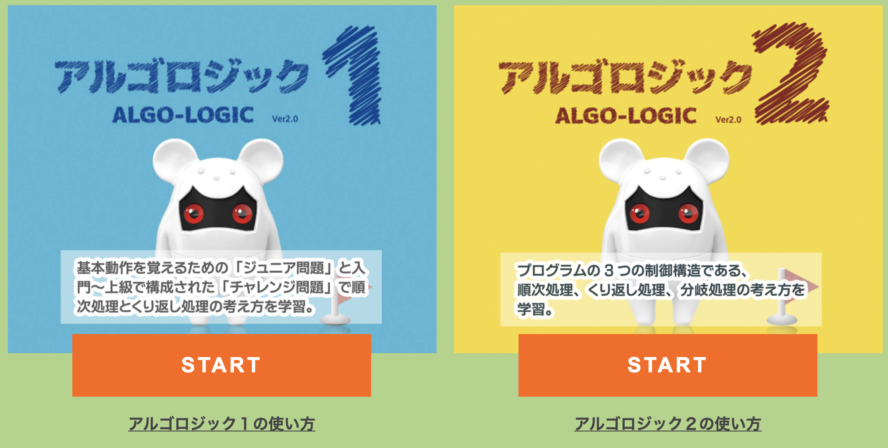
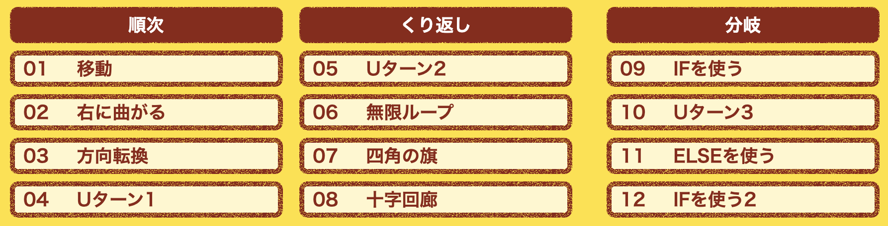
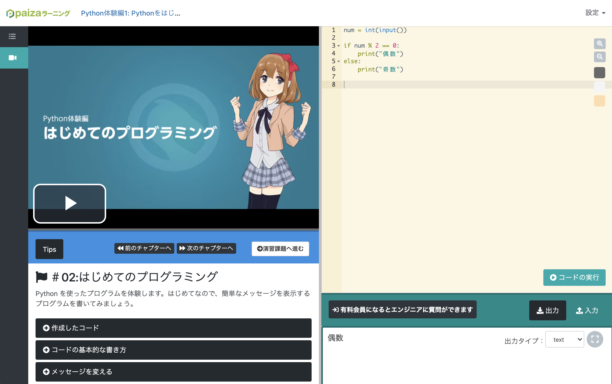

# 前書き

来年度の「情報Ⅰ」の開始に向けて、一番気を揉む内容がプログラミングです。
私自身プログラミングを趣味と言ってもいいほどハマってやっているし、少しだけ企業でプログラマーをしていたこともあります。そういうこともあってあまりプログラミング教育に関してはマークしていなかったのですが、実践してみるとうまくいかないことが多々あったのでそれをここに残しておこうと思います。

# やったこと

## 計画

現行の「社会と情報」も来年度から始まる「情報Ⅰ」も２単位あります。しかし、私の勤務している学校は、「学校設定科目」に１単位あげているので１単位で実施することになります。

プログラミングの授業数は大体１０時間ぐらいと聞いたので、プログラミングの授業は５時間ぐらいになるかな？と想定して今年の授業を組みました。それぞれの時間でやることを次のように決めました。

- アルゴロジック
- paizaによるpythonの基本１
- paizaによるpythonの基本２
- Google Colabを使用したライブラリの使い方
- Google Colabを使用した光学文字認識

以降それぞれの授業の結果をまとめます。今回は前半の３回の授業についてまとめようと思います。

## アルゴロジック

これは、現行の高校生がプログラミングに関わる授業を受けていないので導入したものです。[JEITA(電子情報技術産業協会)](https://home.jeita.or.jp/is/junior/link/link_jeita.html)が作成したウェブ上でビジュアルプログラミングが楽しめるサービスで、ブロックの命令を組み合わせて、クマみたいなキャラに旗を取らせるゲームです。このサービスでプログラミングの基本処理である **順次** ・ **繰り返し** ・ **条件分岐** を理解することができます。

私は授業を１時間使ってこのサービスで遊ばせました。画像にあるように **順次** ・ **繰り返し** ・ **条件分岐** のそれぞれでステージが用意されています。各ステージの最初のチャプターを説明し、あとは生徒に任せました。

ほとんどの生徒は思った以上に集中してやっており、シーンとした時間がほとんどでした。個人的に生徒がワイワイやっている授業が好きな私としては、物足りなく感じてしまったのですが、生徒が自ら集中してやっているので有意義な時間だったと思います。

## paizaによるpythonの基本１・paizaによるpythonの基本２

アルゴロジックをやった次の授業では、２時間かけて[paizaのPython体験編 (全1レッスン)](https://paiza.jp/works/python/trial)を用いてpythonの基礎を習得させました。このサイトは本来ITエンジニアの転職を支援するサイトですが、プログラミング学習のサービスを行っており、解説の動画を見ながらコードを書いてプログラミングを学習することができます。

動画を用いた学習なので生徒が自分のペースで学習できると思い導入しました。これも生徒は集中してやっていました。

# 反省点

## アルゴロジック

これは特にありません。授業が終わった後も生徒どうしで、難しいステージの攻略について話していたので、生徒の意欲にも繋がっていると思います。

一つあげるなら、これは私のミスですが、 **順次** ・ **繰り返し** ・ **条件分岐** をもっと意識するように授業を工夫すべきだったかなと思います。

pythonに入り、テキストプログラミングになった瞬間何がなんだかわからなくなった生徒が多々いたので、そこら辺の工夫は必要かと感じました。

## paizaによるpythonの基本１・paizaによるpythonの基本２

これは、完全にミスでした。主に以下の点で問題がありました。

- 生徒はそれぞれイヤホンをつけて動画を視聴しているので生徒の理解度を授業の様子から伺うことができない。
- 思った以上に理解できていない。

### 生徒の様子が伺えない

生徒はそれぞれに動画を見ながら学習しているので、生徒の理解度を授業の中で把握し、次の授業にフィードバックするということができませんでした。また、イヤホンを忘れた生徒は音声なしで動画を視聴するという事態も起きていたので、忘れ物が多いクラスなどでは、授業自体が成立しない事態も出てきます。

### 思った以上に理解できていない

前述のようなこともあり、生徒の理解度を確認するために２回の授業の後にテストを行ってみたのですが、結果は悲惨でした。

原因の一つに課題の形式があります。paizaの講座では、課題があります。課題の可否はソフトウェア開発のテストと同じように、作成されたプログラムに対して用意されたいくつかの入力を用いて実行し、意図した出力が為されるかで決定されます。課題だけではなく色々なプログラム実行がこの形式で行われます。これがわかりにくくしていたのではないかと思います。例えば、input関数は入力を受けとるという説明を受けたにも関わらず入力が自動で行われる点などです。

また、生徒の身近な問題を取り扱っていなかったところも原因だと考えます。その後別の形でpythonの授業を行った際に、数学の内容などを絡めた問題を出題したところ食いつきがよかったのです。

# 来年への展望

## アルゴロジック

これは来年度もプログラミングの導入として使おうと考えています。

- 生徒が楽しめる
- 今後の生徒はプログラミングを学んで入ってくるが必ずしも定着して入ってくるわけではないと考える
- プログラムの基本である **順次** ・ **繰り返し** ・ **条件分岐** が抑えられる

という理由でです。ここではプログラミングのイメージを掴んでもらうのと **順次** ・ **繰り返し** ・ **条件分岐** を理解してもらうことが目的であり、それを満たしていると思います。

ただし、「授業の最後に **順次** ・ **繰り返し** ・ **条件分岐** の説明を書かせるからそれを意識してやるように」などの発問をした上で授業を実施するなどの工夫をしないと楽しいだけで終わってしまうような気がします。

## paizaによるpythonの基本１・paizaによるpythonの基本２

これは、授業の中で使うより授業の振り返りと定着で使った方がいい教材だと思います。少なくともうちの学校の生徒のほとんどは動画だけで理解できませんでした。うちの生徒のレベルが低いわけでもpaizaさんの教材の質が低いわけでもなく、単純にミスマッチだったと思います。

プログラミングをある程度やってきた私にとってはpaizaさんの教材動画はとても丁寧に作られていて感動しました。しかし、テキストプログラミングという抽象度の高い内容はこれまでこのようなことを体験すらしてきていない生徒にとっては未知のものであり、教師が生徒の手綱を引きながらやる必要があると感じました。

学習指導要領では必ずしもテキストプログラミングを入れることは言われていませんが、大学共通テストを見据えるとどうしてもテキストプログラミングが必要に思えます。

来年度使用するかはわかりませんが、使用するなら、授業の振り返りとして使わせるようにすると思います。
